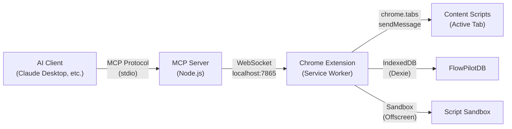

# FlowPilot MCP Server — Implementation Plan

> [!IMPORTANT]
> This plan creates a **fully dynamic MCP server** that automatically discovers all node types, tools, and capabilities from the running extension. Adding new nodes requires **zero MCP server changes**.

## Architecture



### Communication Flow
```
1. AI sends tool call → MCP Server (stdio)
2. MCP Server → WebSocket message → Chrome Extension background
3. Extension processes using existing internal APIs (db, WorkflowRunner, Registry, etc.)
4. Extension → WebSocket response → MCP Server
5. MCP Server → tool result → AI
```

---

## Dynamic Tool Discovery (Key Design)

> [!TIP]
> The MCP server exposes **generic, schema-driven tools** — not one tool per node type. This means adding a new node to `src/nodes/` automatically makes it available via MCP with zero code changes.

**How it works:**
- `list_node_types` → queries `FlowPilotRegistry.getAllManifests()` — returns all registered node types with their full schema
- `add_node(flowId, nodeType, config)` → works with ANY node type
- `get_node_schema(nodeType)` → returns the `initialState`, `ports`, `permissions` for any type
- When the extension registers new nodes (file-based, custom addons, bundles), MCP automatically sees them

---

## MCP Tools (26 total)

### 🔄 Workflow Management (6 tools)
| Tool | Description | Extension API |
|------|-------------|---------------|
| `list_flows` | List all workflows with names, IDs, node counts | `db.workflows.toArray()` |
| `get_flow` | Get full flow graph (nodes, edges, settings) | `db.workflows.get(id)` |
| `create_flow` | Create a new workflow with graph | `db.workflows.add()` |
| `update_flow` | Update flow graph/settings | `db.workflows.update()` |
| `delete_flow` | Delete a workflow | `db.workflows.delete()` |
| `duplicate_flow` | Clone a workflow with new ID | `db.workflows.get()` + `.add()` |

### ▶️ Execution Control (5 tools)
| Tool | Description | Extension API |
|------|-------------|---------------|
| `execute_flow` | Start a workflow execution | `WorkflowRunner.start()` |
| `stop_flow` | Stop a running workflow | `WorkflowRunner.stop()` |
| `pause_flow` | Pause execution | `WorkflowRunner.pause()` |
| `resume_flow` | Resume paused execution | `WorkflowRunner.resume()` |
| `step_flow` | Execute one step (debug mode) | `WorkflowRunner.step()` |

### 🧩 Node Operations (4 tools — ALL DYNAMIC)
| Tool | Description | Extension API |
|------|-------------|---------------|
| `list_node_types` | List ALL available node types with schemas | `Registry.getAllManifests()` |
| `add_node` | Add any node type to a flow | Graph mutation + `manifest.initialState` |
| `update_node` | Update node state/config | Graph mutation |
| `remove_node` | Remove node and its edges | Graph mutation |

### 📊 Data Tables (4 tools)
| Tool | Description | Extension API |
|------|-------------|---------------|
| `list_tables` | List all data tables | `db.data_tables.toArray()` |
| `get_table` | Get table schema + rows | `db.data_tables.get()` |
| `create_table` | Create a new data table | `db.data_tables.add()` |
| `modify_table` | Add/update/delete rows | `TABLE_ACTION` handler |

### 🌐 Global Variables (3 tools)
| Tool | Description | Extension API |
|------|-------------|---------------|
| `list_globals` | List all global tables/variables | `db.global_tables.toArray()` |
| `get_global` | Get global variable data | `GLOBAL_ACTION(getAll)` |
| `set_global` | Create/update global variables | `GLOBAL_ACTION(update)` |

### 🖥️ Browser & Page (3 tools)
| Tool | Description | Extension API |
|------|-------------|---------------|
| `scan_page` | Full DOM scan (AI-readable structured data) | `DOM_SCAN` message |
| `run_js` | Execute JavaScript in active tab | `DOM_EVAL` message |
| `take_screenshot` | Capture tab screenshot (base64) | `chrome.tabs.captureVisibleTab()` |

### 📋 Logs & Diagnostics (2 tools)
| Tool | Description | Extension API |
|------|-------------|---------------|
| `get_logs` | Read execution logs (filterable) | `db.execution_logs` query |
| `clear_logs` | Clear execution logs | `db.execution_logs.clear()` |

---

## File Structure

### New: MCP Server (separate Node.js package)
```
mcp-server/
├── package.json              # Dependencies: @modelcontextprotocol/sdk, ws
├── tsconfig.json
├── src/
│   ├── index.ts              # Entry: starts MCP stdio server + WS server
│   ├── bridge.ts             # WebSocket server → Chrome extension client
│   ├── tools/
│   │   ├── registry.ts       # Dynamic tool registry (loads from extension)
│   │   ├── workflows.ts      # Workflow CRUD tools
│   │   ├── execution.ts      # Run/stop/pause/resume/step tools
│   │   ├── nodes.ts          # Dynamic node type tools
│   │   ├── tables.ts         # Data table tools
│   │   ├── globals.ts        # Global variable tools
│   │   ├── browser.ts        # Page scan, JS execution, screenshot
│   │   └── logs.ts           # Audit log tools
│   └── types.ts              # Shared types
└── README.md                 # Setup instructions
```

### Modified: Chrome Extension (WebSocket bridge client)
```
src/background/
├── mcp/
│   └── McpBridge.ts          # WebSocket CLIENT that connects to MCP server
├── core/
│   └── MessageRouter.ts      # Add MCP message types to routing
├── index.ts                  # Initialize McpBridge on startup
```

### Modified: Extension Manifest
```
manifest.json                 # (if needed) Add any missing permissions
```

---

## Implementation Steps

### Phase 1: MCP Server Foundation
1. Create `mcp-server/` directory with `package.json` and `tsconfig.json`
2. Install `@modelcontextprotocol/sdk` and `ws` packages
3. Create `src/index.ts` — MCP stdio server + WebSocket server on port 7865
4. Create `src/bridge.ts` — manages WS connections, request/response pairing
5. Create `src/types.ts` — shared type definitions

### Phase 2: Extension WebSocket Bridge
6. Create `src/background/mcp/McpBridge.ts` — WS client that connects to `ws://localhost:7865`
7. Wire into `MessageRouter.ts` — route MCP commands to existing handlers
8. Initialize in `src/background/index.ts`

### Phase 3: Tool Implementations
9. Implement workflow tools (CRUD + execution)
10. Implement dynamic node tools (list types, add/update/remove)
11. Implement data table tools
12. Implement global variable tools
13. Implement browser tools (scan, JS eval, screenshot)
14. Implement log tools

### Phase 4: Real-Time Features
15. Execution log streaming via MCP notifications
16. HUD_UPDATE event forwarding for real-time progress

---

## Key Design Decisions

### Why WebSocket (not Native Messaging)?
- **Simpler setup** — no native host manifest registration in OS registry
- **Bidirectional** — supports real-time log streaming
- **Cross-platform** — works on Windows, Mac, Linux without OS-specific config
- **Hot reconnect** — extension reconnects automatically when MCP server restarts

### Why Generic Node Tools (not per-type tools)?
- **Zero maintenance** — adding `src/nodes/ai/GPT_QUERY/` just works
- **Custom addons** — user-created addon nodes are automatically available
- **Bundles** — saved node bundles appear as types without code changes
- **Schema-driven** — AI reads `initialState` and `ports` to understand any node

### Extension-Side Bridge Design
- The McpBridge lives in the **background service worker**
- It connects as a **WebSocket client** to the MCP server's WS server
- Each MCP tool call becomes a JSON message: `{ id, method, params }`
- The bridge dispatches to existing internal APIs (db, WorkflowRunner, Registry)
- Responses return via the same WebSocket with matching `id`

---

## Claude Desktop Config (for the user)

```json
{
  "mcpServers": {
    "flowpilot": {
      "command": "node",
      "args": ["D:/extension/chrome/FlowPilot/mcp-server/dist/index.js"]
    }
  }
}
```

---

## Example AI Interactions After Setup

**"Create a login automation flow"**
```
1. AI calls list_node_types → sees NAVIGATE, TYPE, CLICK, etc.
2. AI calls create_flow → gets new flow ID
3. AI calls add_node(flowId, 'NAVIGATE', { url: 'https://example.com/login' })
4. AI calls add_node(flowId, 'TYPE', { selector: '#email', value: '{{email}}' })
5. AI calls add_node(flowId, 'TYPE', { selector: '#password', value: '{{password}}' })
6. AI calls add_node(flowId, 'CLICK', { selector: '#submit' })
7. Edges auto-connected
```

**"What's on this page?"**
```
1. AI calls scan_page → gets structured DOM data
2. AI analyzes forms, buttons, text content
3. AI suggests automation steps
```

**"Run the 'Data Scraper' flow and show me the results"**
```
1. AI calls list_flows → finds 'Data Scraper' flow
2. AI calls execute_flow(flowId) → starts execution
3. AI receives real-time log updates via notifications
4. AI calls get_table(tableId) → reads scraped data
```
